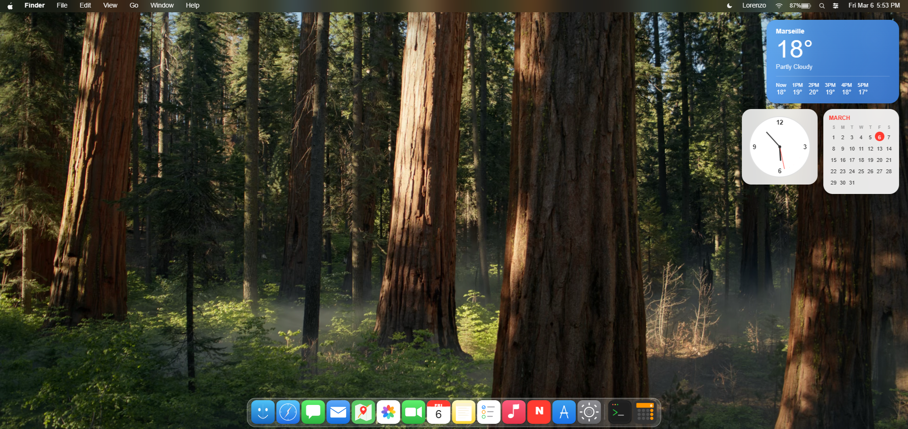

<div align="center">

# macOS Sequoia Web

A faithful recreation of **macOS Sequoia** running entirely in your browser.
Pure HTML, CSS & JavaScript. No frameworks. No dependencies.

**[Try the Live Demo](https://senzo13.github.io/macos-sequoia-web/)**



<br/>


</div>

---

## Features

### Desktop
- Lock screen with blurred wallpaper, clock and password input
- Dark translucent menu bar with Apple logo, Finder menus, Wi-Fi, battery, clock
- Glassmorphism dock with smooth magnification and bounce animation
- Desktop rubber-band selection
- Right-click context menu
- Desktop widgets (weather, analog clock, calendar)

### 16 Built-in Apps
| App | Description |
|-----|-------------|
| **Finder** | Sidebar with favorites, folder grid view |
| **Safari** | URL bar with GitHub profile mockup |
| **Messages** | iMessage-style conversation view |
| **Mail** | Inbox with email previews |
| **Maps** | Map view with search and navigation modes |
| **Photos** | Photo library with grid thumbnails |
| **FaceTime** | Dark UI with recent contacts |
| **Calendar** | Monthly calendar grid with today highlighted |
| **Notes** | Sidebar and lined paper editor |
| **Reminders** | Task list with checkboxes |
| **Music** | Album art grid with sidebar navigation |
| **News** | Article cards with top stories |
| **App Store** | Featured apps with Get buttons |
| **Calculator** | Fully functional with keyboard support |
| **Terminal** | Working shell: `ls`, `whoami`, `pwd`, `neofetch`, `clear`, `echo`, `date` |
| **System Settings** | Settings panel with sidebar and toggles |

### System Features
- **Spotlight Search** — `Ctrl+Space` to search and launch any app
- **Window Management** — Drag, resize, minimize, maximize, close with smooth animations
- **Notification Center** — Click date/time to open
- **Dock** — All 16 apps open their own window on click

## Tech Stack

- **Zero dependencies** — no React, no Vue, no Tailwind, no build step
- **Component architecture** — HTML fragments loaded asynchronously via `fetch()`
- **CSS glassmorphism** — `backdrop-filter: blur()` + `saturate()` for the macOS translucent look
- **Hand-crafted SVG icons** — All dock icons with gradients matching macOS style
- **Responsive** — Adapts to smaller screens

## Project Structure

```
macos-sequoia-web/
  index.html                 # Entry point
  css/style.css              # All styles
  js/
    loader.js                # Async component loader
    app.js                   # All application logic
  components/
    lockscreen.html          # Lock screen
    menubar.html             # Top menu bar
    dock.html                # Dock with 16 app icons
    desktop-icons.html       # Desktop widgets
    windows/
      finder.html            safari.html
      terminal.html          calculator.html
      notes.html             settings.html
      messages.html          mail.html
      maps.html              photos.html
      facetime.html          calendar.html
      reminders.html         music.html
      news.html              appstore.html
  assets/
    wallpaper.jpg            # macOS Sequoia wallpaper
    preview.png              # README screenshot
```

## Getting Started

```bash
# Clone the repo
git clone https://github.com/Senzo13/macos-sequoia-web.git

# Open in browser (no build step needed)
open index.html

# Or use any local server
npx serve .
```

## Keyboard Shortcuts

| Shortcut | Action |
|----------|--------|
| `Ctrl + Space` | Toggle Spotlight Search |
| `Enter` (lock screen) | Unlock desktop |
| Calculator focused | Number keys, +, -, *, /, Enter, Escape |

## Contributing

Contributions are welcome! Feel free to open issues or submit pull requests.

## License

MIT

---

<div align="center">

**If you like this project, give it a star!**

</div>
